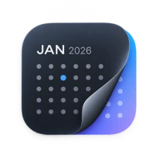
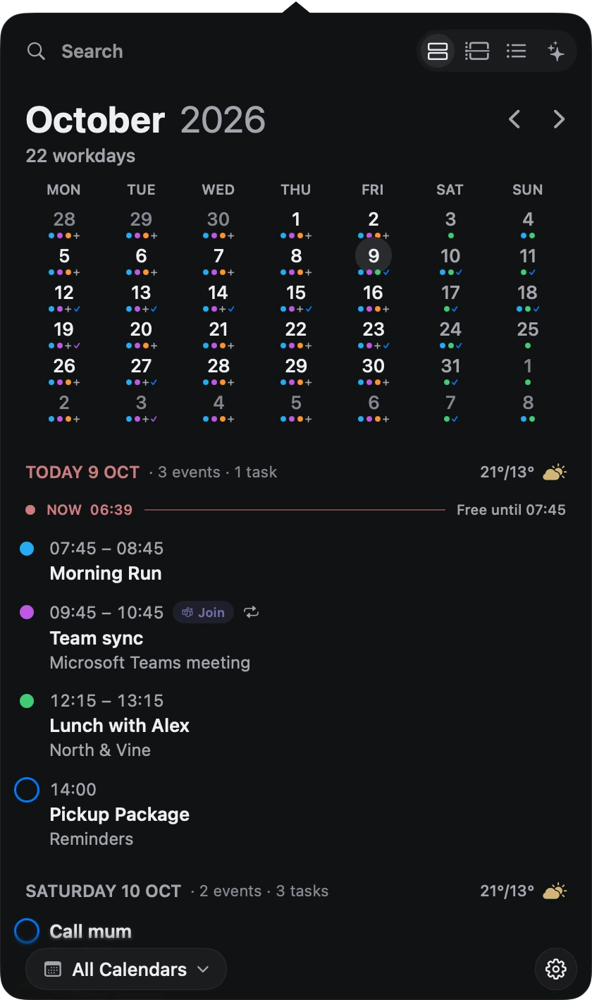
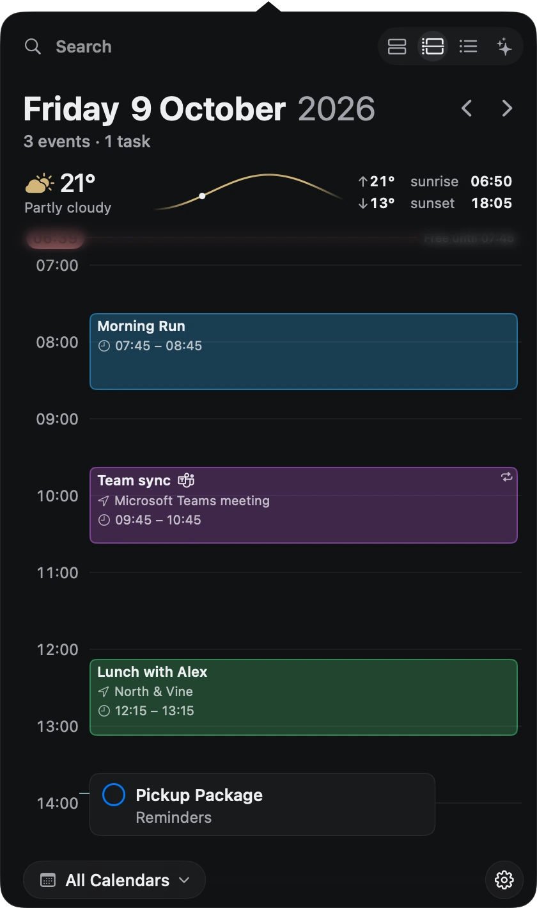
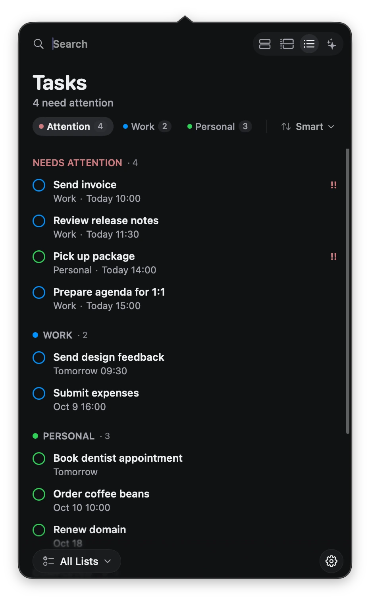
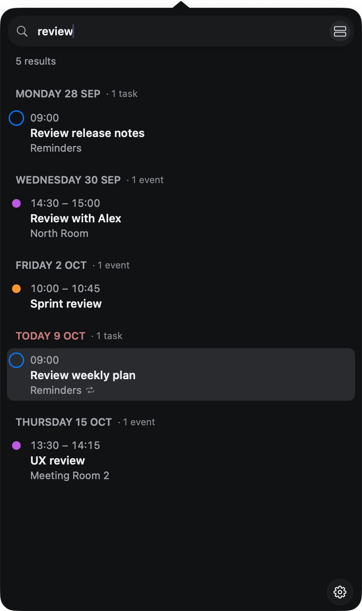
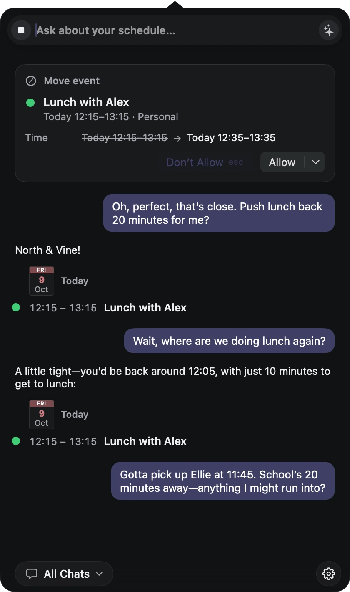
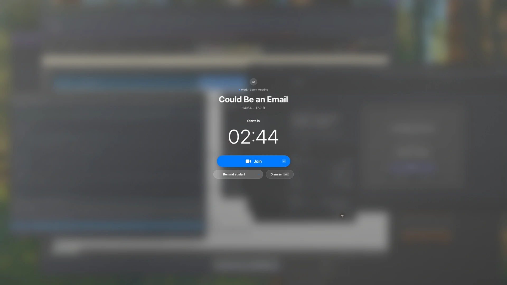

<p align="center">
  
</p>

<h1 align="center">DayEdge</h1>

<p align="center">
  Your calendar and reminders, one click away in the menu bar.<br>
  Native, fast, private, and light enough to forget it's running.
</p>

<p align="center">
  <a href="https://dayedge.app">Website</a> ·
  <a href="https://github.com/dayedge/dayedge/releases/latest">Download</a> ·
  <a href="https://ko-fi.com/dayedge"><strong>Support DayEdge on Ko-fi</strong></a><br>
  <sub>Free and open source. Your support helps keep development going.</sub>
</p>

<p align="center">
  <a href="https://github.com/dayedge/dayedge/releases/latest"></a>
  
  
  
  <a href="LICENSE"></a>
  <a href="CONTRIBUTING.md"></a>
  <a href="https://ko-fi.com/dayedge"></a>
</p>

<p align="center">
  
  <br>
  <sub>Your month ahead and your daily timeline, with events, reminders, and weather.</sub>
</p>

## What it does

- **Month and Day at a glance.** A month grid with your events and tasks, today's agenda, a day timeline,
  and the weather where you are.
- **Tasks from Reminders.** What needs attention first, grouped by list, sorted your way.
- **Search that understands dates.** Type "standup tomorrow" or `from:me after:monday` and jump straight
  there, or create an event or task from the same field.
- **Meeting alerts you won't miss.** A calm full-screen reminder with a Join button for Zoom and
  Microsoft Teams.
- **Chat about your schedule.** Ask what's next, find free time, or move a meeting. It runs on Apple's
  on-device model by default; chat data stays on your Mac unless you choose an external provider.
  Changes need approval. External chat can remember permission for selected actions; deletions always ask.
- **Keyboard-first.** Shortcuts for every view and the common actions, and you can change them.
- **Made to feel at home.** Eight themes, light and dark, in English and Polish.

<p align="center">
  
  
  <br>
  <sub>Organise your tasks, find the right event, and talk through a change of plans.</sub>
</p>

<p align="center">
  <br>
  <sub>A full-screen nudge for the “one more minute” crowd.</sub>
</p>

## Privacy

DayEdge processes your Apple Calendar and Reminders data locally. There are no DayEdge accounts,
analytics or DayEdge-operated servers. Chat runs on your Mac unless you choose to connect an external
model. Optional external chat, weather and other services are described in [PRIVACY.md](PRIVACY.md).

## Install

Requires macOS 15 or later. Homebrew selects the Apple Silicon or Intel build automatically:

```sh
brew install --cask dayedge/tap/dayedge
```

DayEdge is self-signed and not notarized by Apple. The [Homebrew tap](https://github.com/dayedge/homebrew-tap)
removes download quarantine from DayEdge.app after installation and upgrades; global macOS security settings stay unchanged.

For manual installation, download the matching archive from [Releases](https://github.com/dayedge/dayedge/releases/latest),
unzip it, and move DayEdge to Applications. After trying to open it, use **System Settings → Privacy & Security → Open Anyway**
if macOS blocks it. See [Apple's instructions](https://support.apple.com/en-us/102445).

Chat needs macOS 26 with Apple Intelligence, or your own provider key.

The interface follows your Mac's language: English or Polish. Natural-language event/task entry and
search date expressions are currently English. Apple's on-device chat does not currently support
Polish; external chat language support depends on the model you choose.

Or build it yourself (needs Xcode 26):

```sh
git clone https://github.com/dayedge/dayedge.git
cd dayedge
make signing-identity   # once, so macOS remembers DayEdge's permissions between builds
make run
```

## Contributing

DayEdge is built in the open, and contributions are welcome: bug reports, ideas, translations and
code. Features are discussed and decided together in issues. Start with
[CONTRIBUTING.md](CONTRIBUTING.md); the code rules are in [AGENTS.md](AGENTS.md).

Found a security issue? Please report it privately, as described in [SECURITY.md](SECURITY.md).

## Support

**[Support DayEdge on Ko-fi](https://ko-fi.com/dayedge)**

DayEdge is free and open source. Contributions help fund maintenance, testing and new releases.
Support is optional; all features are available to everyone. Bug reports, translations and code
contributions help too.

## License

[Mozilla Public License 2.0](LICENSE).
Third-party software and font notices are bundled with the app; see
[third-party notices](Packages/DayEdge/Sources/Shell/Resources/THIRD_PARTY_NOTICES.txt).
